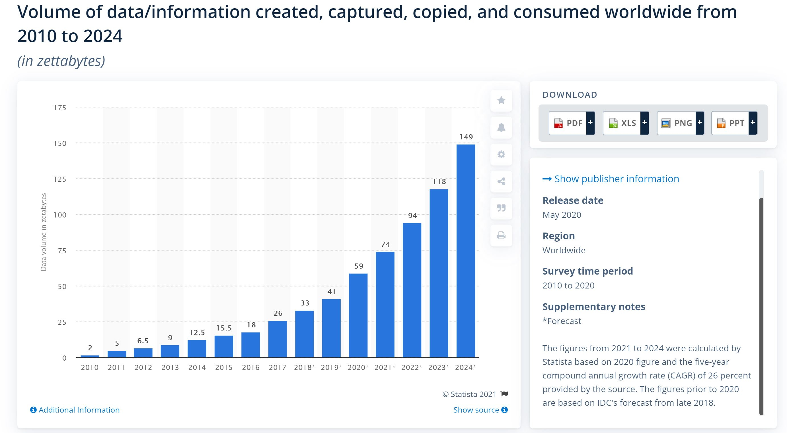
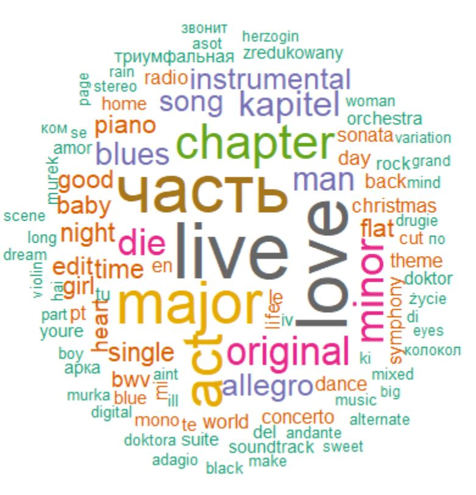

<style type="text/css">
  body{
  font-size: 14pt;
}
</style>

```{r setup, include=FALSE}
knitr::opts_chunk$set(echo = TRUE, warning = FALSE, message = FALSE)
```

```{r}
library(tidyverse)
library(plotly)
library(gridExtra)
library(reshape2)
library(DT)
```

```{r}
data <- read.csv("data.csv", encoding = 'UTF-8') %>% filter(year <= 2020)
data <- data %>% 
  select(id, name, artists, year, release_date, everything())
```

Terms like  **Data is the new _____**, substituted with **gold/oil/currency/whatever is the most precious asset to have for you**, are becoming quite prevalent in our conversations and news feed. As per the [statista reoprt]([https://www.statista.com/statistics/871513/worldwide-data-created/) released in May 2020, 2021 is expected to create, capture, copy, and consume 74 zettabytes (1 zettabyte = trillion gigabytes) of data worldwide. This number is projected to almost double in just 3 years by 2024.

```{r , echo=FALSE, fig.cap="Statista report on data creation/consumption", out.width = '100%'}

```


The [episode data detective of the cautionary tales podcast by Tim Hartford](https://podcasts.google.com/feed/aHR0cHM6Ly9mZWVkcy5tZWdhcGhvbmUuZm0vY2F1dGlvbmFyeXRhbGVz/episode/NTUxMTZjNjQtNWYxOC0xMWViLTkzMzEtMGI0MWJmZTYzZDE2?sa=X&ved=0CAUQkfYCahcKEwiY7_aA7sfvAhUAAAAAHQAAAAAQAQ) aptly mentions that every human being is moderately curious or moderately incurious. It further suggests that there is no such thing as _a curious person_. Curiosity is a cultivated trait and can be infused or diffused by context and subject. 

Being surrounded by mountains and mountains of data can ignite curiosity even in the most bored minds like mine. Despite being an avid and yet not bored listner of Indian classical and pop music, I have decided to explore the wilderness of Western music (for the lack of a better term) using Spotify data in hope to learn a few things on the way. 

# Data at perusal

I have obtained all Spotify tracks for US market ranging from 1920 to 2020 (100 years!) from a [Kaggle dataset](https://www.kaggle.com/yamaerenay/spotify-dataset-19212020-160k-tracks).  Each row ideally represents a track, with a Spotify track id, artist's name, track's name, and a bunch of audio features associated with the track. A sample of the data from year 2020 is shown below.


```{r}
datatable(
  head(
    data %>% 
      filter(year==2020)
    ), 
  rownames = FALSE, 
  options = list(dom = 'tp',
                 pageLength = 5,
                 scrollX = TRUE)
  )
```


Before our curiosity nudges us to look for data related to our favorite artists, let's first understand the data. 

## Data types

We have few categorical fields like `id`, `name`, `artists`, `release_date`, and `key` that can take finite number of values. We also have many numerical fields, most from the audio features, like `acousticness`, `danceability` etc., that can take infinite number of values within a defined range. Notice that we have two fields - `mode` and `explicit` that are logical/binary in nature. 

## Data definitions

The table below has the definitons of all the fields including the definitions of various audio features. 

```{r}
data_dict <- tibble("field" = names(data),
                    "definition" = c("Track unique id",
                                     "Track name",
                                     "Artist name",
                                     "Year the track was released",
                                     "Date the track was released",
                                     "A confidence measure from 0.0 to 1.0 of whether the track is acoustic. 1.0 represents high confidence the track is acoustic.",
                                     "Danceability describes how suitable a track is for dancing based on a combination of musical elements including tempo, rhythm stability, beat strength, and overall regularity. A value of 0.0 is least danceable and 1.0 is most danceable.",
                                     "Duration of the song in milliseconds",
                                     "Energy is a measure from 0.0 to 1.0 and represents a perceptual measure of intensity and activity. Typically, energetic tracks feel fast, loud, and noisy. For example, death metal has high energy, while a Bach prelude scores low on the scale. Perceptual features contributing to this attribute include dynamic range, perceived loudness, timbre, onset rate, and general entropy.",
                                     "If the track contains explicit content",
                                     "Predicts whether a track contains no vocals. “Ooh” and “aah” sounds are treated as instrumental in this context. Rap or spoken word tracks are clearly “vocal”. The closer the instrumentalness value is to 1.0, the greater likelihood the track contains no vocal content. Values above 0.5 are intended to represent instrumental tracks, but confidence is higher as the value approaches 1.0.",
                                     "The estimated overall key of the track. Integers map to pitches using standard Pitch Class notation . E.g. 0 = C, 1 = C#/Db, 2 = D, and so on. If no key was detected, the value is -1.",
                                     "Detects the presence of an audience in the recording. Higher liveness values represent an increased probability that the track was performed live. A value above 0.8 provides strong likelihood that the track is live.",
                                     "The overall loudness of a track in decibels (dB). Loudness values are averaged across the entire track and are useful for comparing relative loudness of tracks. Loudness is the quality of a sound that is the primary psychological correlate of physical strength (amplitude). Values typical range between -60 and 0 db.",
                                     "Mode indicates the modality (major or minor) of a track, the type of scale from which its melodic content is derived. Major is represented by 1 and minor is 0.",
                                     "The popularity of the track. The value will be between 0 and 100, with 100 being the most popular. The popularity of a track is a value between 0 and 100, with 100 being the most popular. The popularity is calculated by algorithm and is based, in the most part, on the total number of plays the track has had and how recent those plays are. Generally speaking, songs that are being played a lot now will have a higher popularity than songs that were played a lot in the past.",
                                     "Speechiness detects the presence of spoken words in a track. The more exclusively speech-like the recording (e.g. talk show, audio book, poetry), the closer to 1.0 the attribute value. Values above 0.66 describe tracks that are probably made entirely of spoken words. Values between 0.33 and 0.66 describe tracks that may contain both music and speech, either in sections or layered, including such cases as rap music. Values below 0.33 most likely represent music and other non-speech-like tracks.",
                                     "The overall estimated tempo of a track in beats per minute (BPM). In musical terminology, tempo is the speed or pace of a given piece and derives directly from the average beat duration.",
                                     "A measure from 0.0 to 1.0 describing the musical positiveness conveyed by a track. Tracks with high valence sound more positive (e.g. happy, cheerful, euphoric), while tracks with low valence sound more negative (e.g. sad, depressed, angry)."))

datatable(
  data_dict,
  rownames = FALSE,
  options = list(dom = 'tp',
                 pageLength = 5, 
                 scrollX = TRUE),
  caption = "Sourced from https://github.com/rfordatascience/tidytuesday/blob/master/data/2020/2020-01-21/readme.md"
  )
```


After performing few validation checks on the ideal state of this data (one record per one song), certain issues appeared with this data in terms of how it is curated. A track can be added to Spotify as a single entry and/or as part of an album with an individual id for each occurrence. The same track can also be added multiple times with different release dates. As per the their documentation, this used to be the case more often in the older years. With the implementation of  "track linking" in the most recent years, such duplicative pattern is less seen in the data. However, we need to overcome this issue in the data, otherwise we would be double counting the statistics which could be misleading.

One way to tackle this issue is to keep the track, a combination of an artist and a track name, that was released the earliest when it appears multiple times. For example, **Rain On Me (with Ariana Grande)** track has two entries in the data with release dates of `r format(as.Date("2020-05-22"), "%b %d %Y")` and `r format(as.Date("2020-05-29"), "%b %d %Y")` from which we would choose the one released on `r format(as.Date("2020-05-22"), "%b %d %Y")`. By following this method, we will not be favoring the popularity measure (correlated with recent number of plays) for a track and an artist that could have tracks released across various years with varying popularity measures. 

After cleaning the data, we have total of **158,581** tracks a reduction of ~14,000 records with duplicate entries. 

```{r}
datatable(
  data %>%
    filter(name=="Rain On Me (with Ariana Grande)"),
  rownames = FALSE,
  options = list(dom = 'tp',
                 pageLength = 5)
  )
```


```{r}
key_map <- rev(c("0" = "C", "1" = "C#", "2" = "D", "3" = "D#", "4" = "E", "5" = "F", "6" = "F#", "7" = "G", "8" = "G#", "9" = "A", "10" = "A#", "11" = "B"))

data_prc <- data %>%
  mutate(id = as.character(id)) %>%
  #select(-id, -release_date) %>% # duplicate records for different ids and release date
  distinct() %>%
  # same song with same artist have multiple records with slight changes in audio featues and year
  arrange(name, artists, year, release_date) %>% 
  group_by(name, artists) %>%
  filter(id==min(id)) %>%
  #filter(popularity == max(popularity)) %>%
  ungroup() %>%
   mutate(popularity_category = ifelse(popularity >= 80, "80+", "<80"),
          valence_bin = cut(valence, seq(0,1,0.1), right = FALSE),
          duration_min = duration_ms/(1000*60),
          mode_type = case_when(mode==0 ~ "minor",
                                mode==1 ~ "major"),
          key_str = as.character(key),
          key_group = str_replace_all(key_str, key_map))
```


# Year over year trends

We now have a fair understanding of the data and have processed the same appropriately. It's time to observe some trends then.

## How many tracks and associated artists are released and each year on Spotify?

The number of tracks released on Spotify fluctuates a lot between 1920 and 1950. Since 1950, around 2,000 tracks were released until 1999. The number dropped by almost half in 2000-2001 and is steadily increasing since 2004.  Interestingly, the number of tracks increased by 1.5 in 2020. I am reigning my temptation to associate reasons with the high level fluctuations in number of tracks over years since Spotify is not the most exhaustive platform to host all the music that gets created. However, the trends are certainly intriguing and demands further understanding and investigation of the data.   

The number of unique artists who released tracks by years has an increasing trend across all years, including the years when number of tracks were stable around 2,000.    


```{r}
ggplotly(
  data_prc %>%
  group_by(year) %>%
  summarise(tracks = n(),
            artists = n_distinct(artists)) %>%
  ungroup() %>% 
  ggplot(aes(x = year, y = n, group = 1)) +
  geom_line(aes(y = tracks, color = "tracks")) +
  geom_point(aes(y = tracks, color = "tracks")) +
  geom_line(aes(y = artists, color = "artists")) +
  geom_point(aes(y = artists, color = "artists")) +
  scale_x_continuous(breaks = seq(1910, 2020, 10)) +
  scale_color_manual(values = c("tracks" = "#8d52eb", "artists" = "#ec576c")) +
  theme(axis.text.x = element_text(angle = 90),
        legend.title = element_blank()) +
  labs(y = "tracks vs artists")
)

```

## How has the popularity measure changed over time on Spotify?

The mean popularity has gone down since year 2000 while the maximum popularity in a year has been on the rise suggesting that despite having more tracks in the recent years, not all gained equally higher popularity. 2020 recorded the highest maximum popularity score of 96 out of 100. This also could be partly because of the method of popularity calculation which weighs more on number of plays in the recent time period.  

```{r}
ggplotly(
  data_prc %>%
  group_by(year) %>%
  summarise(mean_popularity = mean(popularity),
            max_popularity = max(popularity)) %>%
  ggplot(aes(x = year, group = 1)) +
  geom_line(aes(y = mean_popularity, color = "mean_popularity")) +
  geom_point(aes(y = mean_popularity, color = "mean_popularity")) +
  geom_line(aes(y = max_popularity, color = "max_popularity")) +
  geom_point(aes(y = max_popularity, color = "max_popularity")) +
  scale_x_continuous(breaks = seq(1910, 2020, 10)) +
  scale_color_manual(values = c("mean_popularity" = "#aaf6b1", "max_popularity" = "#019875")) +
  labs(y = "mean and max popularity") +
  theme(axis.text.x = element_text(angle = 90),
        legend.title = element_blank())
)

```


### What is the anatomy of the most popular track(s)? 

There are two most popular tracks released in 2020 to gain popularity of 96 - **positions** by _Ariana Grande_ and **Mood (feat. iann dior)** by _24kGoldn_. 

Both the tracks are on the higher end of valence (happy mood), energy, and danceability. Both have explicit content present and have 0 instrumentalness. Positions is set in a major mode while the other is set in a minor mode. 

Having high energy and danceability is the key to higher popularity? We will find out soon in a next segment. But, before that, let's check out the trends in audio features over 100 years. To able to compare them on a standard scale, we would normalize the numeric values of these features.  
 
```{r fig.dim=c(10,10)}
audio_features <- c("acousticness", "danceability", "duration_min", "energy", "instrumentalness", "explicit", "liveness", "loudness", "key", "mode", "speechiness", "tempo", "valence")

ggplotly(
  data_prc %>%
  filter(popularity==max(popularity)) %>%
  pivot_longer(cols = all_of(audio_features), names_to = "feature_name", values_to = "feature_value") %>%
  ggplot(aes(x = name, y = feature_value, fill = name)) +
  geom_col() +
  facet_wrap(~feature_name, scales = "free_y") +
  theme(axis.text.x = element_text(angle = 45))
)

```

## How have the audio features changed over years?

The trend in average value of audio features is shown as following. 

The average acousticness has drastically reduced over the years with increasing invention of electronic instruments. The average energy of tracks has drmamatically increased over the years, almost at the same time acousticness started reducing. Could there be a correlation there? 

The average loudness of the tracks has slightly increased. The average valence has slightly decreased on the other hand. Instrumentalness was more present in earlier years although there has been an uptick in the recent years for the same. 

```{r}
rescale <- function(x) (x-min(x))/(max(x) - min(x))
scales_data_prc <- data_prc %>%
  mutate(year = as.character(year)) %>%
  mutate_if(is.numeric, ~rescale(.)) %>%
  mutate(year = as.integer(year))
```

```{r}
audio_features_2 <- c("acousticness", "danceability", "energy", "instrumentalness", "liveness", "loudness", "speechiness", "tempo", "valence")
ggplotly(
  scales_data_prc %>%
  pivot_longer(cols = all_of(audio_features_2), names_to = "feature_name", values_to = "feature_value") %>%
  group_by(year, feature_name) %>%
  summarise(mean_feature_value = mean(feature_value)) %>%
  ungroup() %>%
  ggplot(aes(x = year, y = mean_feature_value, color = feature_name)) +
  geom_line() +
  geom_point() +
  scale_x_continuous(breaks = seq(1910, 2020, 10)) +
  scale_color_brewer(palette = "Set3")
)

```


Below are the trends for audio features that are either logical or categorical for which taking an average would not have been appropriate. 

### Major/minor mode

There have been more tracks set in minor mode in recent years. Generally speaking, minor mode tracks tend to have sad/gloomhy mood. This is in line with decreasing valence in the recent years.  

```{r}
ggplotly(
  data_prc %>%
  count(year, mode_type) %>%
  group_by(year) %>% 
  mutate(perc_tracks = n/sum(n)) %>% 
  ungroup() %>% 
  ggplot(aes(x = year, y = perc_tracks, fill = mode_type, group = 1)) +
  geom_col() +
  scale_x_continuous(breaks = seq(1910, 2020, 10))
)

```


### explicit content

Tracks with explicit conent has been increasing since 1980s. 

```{r}
ggplotly(
  data_prc %>%
  count(year, explicit) %>%
  group_by(year) %>% 
  mutate(perc_tracks = n/sum(n)) %>% 
  ungroup() %>% 
  ggplot(aes(x = year, y = perc_tracks, fill = factor(explicit))) +
  geom_col() +
  scale_x_continuous(breaks = seq(1910, 2020, 10))
)

```

<!-- # key -->

<!-- ```{r} -->

<!-- data_prc %>% -->
<!--   count(year, key_group) %>% -->
<!--   group_by(year) %>% -->
<!--   mutate(perc = n/sum(n)) %>% -->
<!--   ggplot(aes(x = year, y = perc, fill = key_group)) + -->
<!--   geom_col() + -->
<!--   scale_fill_brewer(palette = "Paired") + -->
<!--   scale_x_continuous(breaks = seq(1910, 2020, 10)) -->
<!-- ``` -->

### duration

Average duarion of the tracks in minutes has been fluctuating between 4 to 4.5 minutes since 1970. Spotify has collected **`r round(sum(data_prc$duration_min)/(60*24*365), 2)`** years of tracks over 100 years!! If you would rather not spend that much time listening to each and every song but dance on the most "danceability" song, get wild listening to **Funky Cold Medina** by _Tone-Loc_. 

```{r}
ggplotly(
  data_prc %>%
  group_by(year) %>%
  summarise(mean_dur = mean(duration_min)) %>%
  ungroup() %>% 
  ggplot(aes(x = year, y = mean_dur)) +
  geom_line(color = "#800000") + geom_point(color = "#800000") +
  labs(y = "mean duration (mins)") +
  scale_x_continuous(breaks = seq(1910, 2020, 10))
)

```

# Correlation of audio features

Plotting the trends of audio features over years invoked some curiosity around if these features are inter related and if so, how? 

Below graph shows corrleation of each audio feature with other audio features. Note that mode and key are excluded from this matrix as they are more like categorical variables.  Colors closer to orange showcase higher positive correlation, colors closer to purple showcase neutral correlation, while colors closer to dark blue show negative correlation. 

It is quite trivial to point out that each audio feature is correlated to itself with 100% positive correlation. Energy is negatively correlated with acousticness which aligns with what we observed in the trends over years earlier. 

Popularity is negatively correlated with acousticness and positively correlated with energy. 

Loudness is highly correlated with energy which makes loudness negatively correlated with acousticness too. 

Danceability is positively correlated with valence of the track, not surprising!

```{r}
ggplotly(
  melt(cor(data_prc %>%
      select(c(audio_features_2, "popularity")))) %>%
  ggplot(aes(x = Var1, y = Var2, fill = value)) +
  geom_tile() +
  scale_fill_gradient2(low = "#003366", high = "orange", mid = "purple") +
  theme(axis.text.x = element_text(angle = 90)) +
  labs(x = "", y = "")
)

```


Each of the above mentioned correlation observations are visualized in one chart below to fit linear trends. When we want to predict the value of an audio feature from the rest of audio features, these correlation plots could be very useful to understand the dependencies.  

```{r}
p_acoustic <- data_prc %>%
  mutate(acoustic_bin = cut(acousticness, seq(0,1.1,0.0001), right = FALSE)) %>%
  group_by(acoustic_bin) %>%
  summarise(mean_popularity = mean(popularity),
         mean_acoustic = mean(acousticness)) %>%
  ungroup() %>%
  ggplot(aes(x = mean_acoustic, y = mean_popularity)) +
  geom_point(alpha = 0.2, size = 3) +
  geom_smooth(method = "lm") +
  labs(title = str_glue("correlation = {round(cor(data_prc$acousticness, data_prc$popularity),2)}"))

```

```{r}
p_energy <- data_prc %>%
  mutate(energy_bin = cut(energy, seq(0,1.1,0.0001), right = FALSE)) %>%
  group_by(energy_bin) %>%
  summarise(mean_popularity = mean(popularity),
         mean_energy = mean(energy)) %>%
  ungroup() %>%
  ggplot(aes(x = mean_energy, y = mean_popularity)) +
  geom_point(alpha = 0.2, size = 3) +
  geom_smooth(method = "lm") +
  labs(title = str_glue("correlation = {round(cor(data_prc$energy, data_prc$popularity),2)}"))
```

```{r}
p_energy_loudness <- data_prc %>%
  mutate(loudness_bin = cut(loudness, seq(0,-60,-0.01), right = FALSE)) %>%
  group_by(loudness_bin) %>%
  summarise(mean_energy = mean(energy),
         mean_loudness = mean(loudness)) %>%
  ungroup() %>%
  ggplot(aes(x = mean_loudness, y = mean_energy)) +
  geom_point(alpha = 0.2, size = 3) +
  geom_smooth(method = "lm") +
  labs(title = str_glue("correlation = {round(cor(data_prc$energy, data_prc$loudness),2)}"))
```


```{r}
p_valence_dance <- data_prc %>%
  mutate(dance_bin = cut(danceability, seq(0,1,0.0001), right = FALSE)) %>%
  group_by(dance_bin) %>%
  summarise(mean_valence = mean(valence),
         mean_dance = mean(danceability)) %>%
  ungroup() %>%
  ggplot(aes(x = mean_dance, y = mean_valence)) +
  geom_point(alpha = 0.2, size = 3) +
  geom_smooth(method = "lm") +
  labs(title = str_glue("correlation = {round(cor(data_prc$valence, data_prc$danceability),2)}"))

```


```{r}
grid.arrange(p_acoustic, p_energy, p_energy_loudness, p_valence_dance, nrow = 2)
```

# Top 20 most productive artists

Below chart shows artists by number of songs released on Spotify over 100 years. The shading represents time between release of their first track to last track. Top 4 most productive artists by a bigger margin have been active for < 30 years between 1920 to 1950. Higher number of active years may have some correlation with popularity as they could consistently releasing tracks over many years. **Ella Fitzgerald** is one of the early artists (from 1920s) whose last track was added in 1999 yet ranks pretty high on the popularity spectrum (73). **Frank Sinatra** has been active for most amount of years among the top 20 artists. 

I could not resist but notice our beloved **Lata Mangeshkar ji's** name sitting nicely between **The Beatles** and **Queeen**

```{r}
ggplotly(
  data_prc %>%
  group_by(artists) %>%
  summarise(n_songs = n(),
            first_activity = min(year),
            last_activity = max(year)) %>%
  ungroup() %>%
  mutate(years_active = last_activity - first_activity + 1) %>%
  arrange(desc(n_songs)) %>%
  head(20) %>%
  ggplot(aes(x = reorder(artists, n_songs), y = n_songs, fill = years_active)) +
  geom_col() +
  labs(y = "artist", x = "tracks") +
  coord_flip()
)
```

## Audio features of tracks by Lata Mangeshkar

The most popular song of Lata Mangeshkar is **Aaj Phir Jeene Ki Tamanna Hai** released in 1965. Below chart shows that her tracks are on the high spectrum of acousticness (not surprising). Danceability is in the medium range. Her tracks on Spotify are mostly on the higher end of valence. Since Spotify might have limited tracks from this prolific artist, it might be best to no conclude anything in particular.  

```{r}
# data_prc %>%
#   filter(artists=="['Lata Mangeshkar']") %>%
#   arrange(desc(popularity))

ggplotly(
  scales_data_prc %>%
  filter(artists=="['Lata Mangeshkar']") %>%
  pivot_longer(audio_features_2, names_to = "feature_name", values_to = "feature_value") %>%
  ggplot(aes(x = feature_name, y = feature_value, color = feature_name)) +
  geom_jitter(size = 3, alpha = 0.4) +
  theme(axis.text.x = element_text(angle = 90)) +
  scale_color_brewer(palette = "Set3")
)

```


## Audio features of tracks by few other popular artists

**The Beatles**: The most popular song recorded on Spotify is **Come Together - Remastered 2009** with popularity score of 78

**Queen**: The most popular song recorded on Spotify is **Don't Stop Me Now - Remastered 2011** with popularity score of 73

**Coldplay**: The most popular song recorded on Spotify is **Yellow** with popularity score of 85

Below is their anatomy of audio features. 


```{r}
# data_prc %>%
#   filter(artists=="['The Beatles']") %>%
#   arrange(desc(popularity))

ggplotly(scales_data_prc %>%
  filter(artists=="['The Beatles']") %>%
  pivot_longer(audio_features_2, names_to = "feature_name", values_to = "feature_value") %>%
  ggplot(aes(x = feature_name, y = feature_value, color = feature_name)) +
  geom_jitter(size = 3, alpha = 0.5) +
  theme(axis.text.x = element_text(angle = 90)) +
  scale_color_brewer(palette = "Set3")+
  labs(title = "The Beatles"))
```


```{r}
# data_prc %>%
#   filter(artists=="['Queen']") %>%
#   arrange(desc(popularity))

ggplotly(scales_data_prc %>%
  filter(artists=="['Queen']") %>%
  pivot_longer(audio_features_2, names_to = "feature_name", values_to = "feature_value") %>%
  ggplot(aes(x = feature_name, y = feature_value, color = feature_name)) +
  geom_jitter(size = 3, alpha = 0.5) +
  theme(axis.text.x = element_text(angle = 90)) +
  scale_color_brewer(palette = "Set3") +
  labs(title = "Queen"))


```


```{r}
# data_prc %>%
#   filter(artists=="['Coldplay']") %>%
#   arrange(desc(popularity))

ggplotly(scales_data_prc %>%
  filter(artists=="['Coldplay']") %>%
  pivot_longer(audio_features_2, names_to = "feature_name", values_to = "feature_value") %>%
  ggplot(aes(x = feature_name, y = feature_value, color = feature_name)) +
  geom_jitter(size = 3, alpha = 0.5) +
  theme(axis.text.x = element_text(angle = 90)) +
  scale_color_brewer(palette = "Set3") +
  labs(title = "Coldplay"))
```


# Common words in track names


Top 100 words from 100 years have **Love** and **live** as the most common words in all track names after excluding commonly used words like _a/an/the/you/me/I/mixed/remaster_ etc. and years. I also wonder which **live** the verb or the now has been used the most commonly in track names. This might require an another blog on sentiment analysis. For now, let's wish it is live the verb. 

```{r , echo=FALSE, fig.cap="Top 100 words over 100 years", out.width = '100%'}

```

It is quite interesting to see words related to work out as more common words in tracks in year 2020. 


```{r , echo=FALSE, fig.cap="Top 100 words in 2020", out.width = '100%'}

```

# Concluding remarks

As you already might be feeling exhausted by going through the various slices of data and extracting some insights from them, such exploratory data analysis could become a never ending task without a clear end goal in mind. It is a common practice to perform such explorations before developing a predictive model in the field of data science. As we gained decent understanding of the data and their correlation with each other, one could build a model to predict popularity based on audio features. Moreover, with additional data on genres and artists, a recommendation engine could also be developed. 

Music has always been a steady companion for me, especially in the pandemic. It moves me emotionally and physically and lets me live in a single state of mind - ecstacy. Hope you had some of your musical and analytical curiosiry satisfied through this blog.  